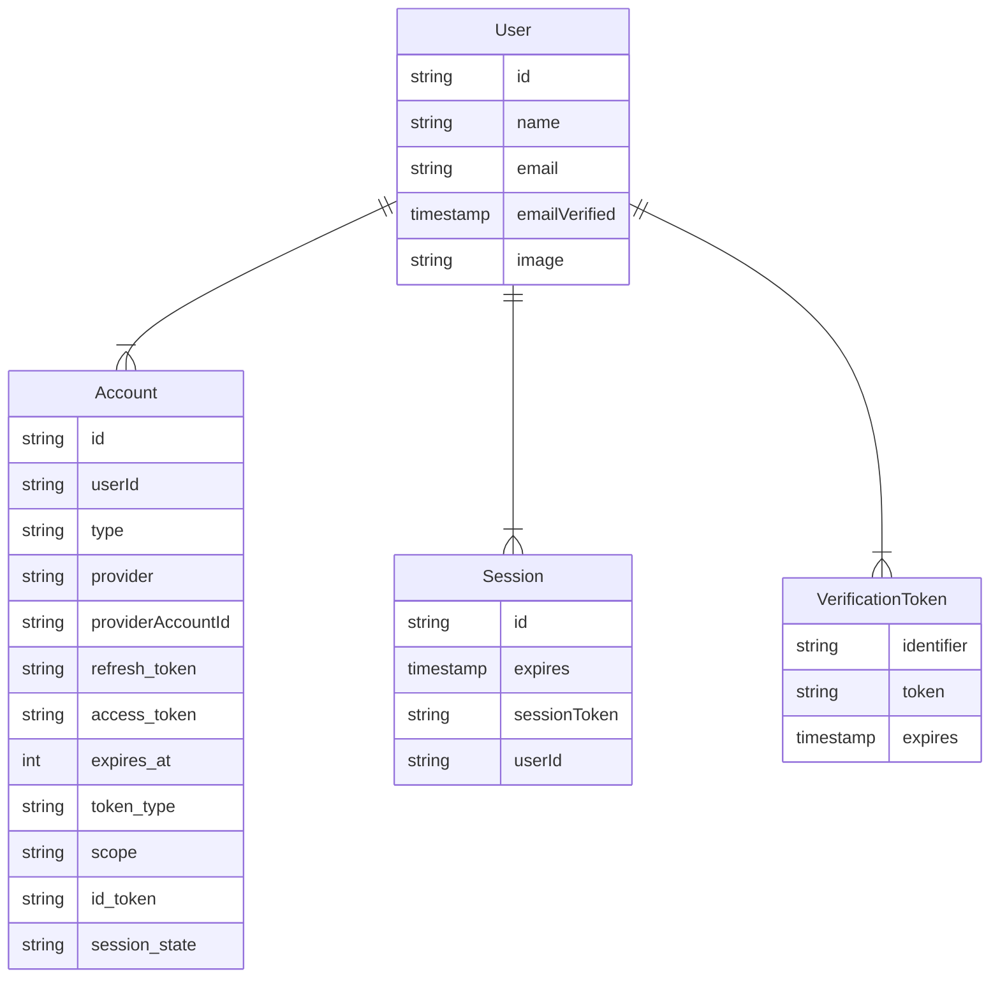

import { Callout } from "nextra/components"

# 数据库模型

Auth.js 可与任何数据库配合使用。模型定义了 Auth.js 对数据库结构的预期要求。根据使用的适配器不同，模型会略有差异，但总体结构与下方图示相似。每个模型均可通过额外字段进行扩展。

<Callout type="info">
  Auth.js 对其数据库行使用 `camelCase` 命名法，同时遵循 OAuth 相关值的传统
  `snake_case`
  格式。若混合命名方式对您造成困扰，多数适配器文档都专门介绍了如何强制统一命名规范。
</Callout>

---

### 用户模型

用户模型存储姓名、电子邮箱等信息。邮箱地址为可选字段，但若为某 `User` 指定了邮箱，则该邮箱必须保持唯一性。

<Callout>
  数据库中的用户创建是自动完成的，在用户首次通过认证提供方（OAuth、魔法链接或普通凭证）登录时触发。
</Callout>

**OAuth 登录**

若首次登录通过 [OAuth 提供方](/getting-started/authentication/oauth) 完成，默认保存的数据包括 `id`、`name`、`email` 和 `image`。您可通过在 [OAuth 提供方](/guides/configuring-oauth-providers#use-your-own-provider) 的 [`profile()`](/reference/core/providers#profile) 回调中返回额外字段来补充更多资料数据。

**魔法链接登录**

如果首次登录是通过[Email Provider](/getting-started/authentication/email)，那么保存的用户将包含`id`、`email`、`emailVerified`字段，其中`emailVerified`是用户创建时的时间戳。

### 账户

Account模型用于存储与`User`关联的账户信息。单个`User`可以拥有多个`Account`，但每个`Account`只能属于一个`User`。

<Callout>
  数据库中的账户创建是自动进行的，当用户首次通过认证提供者（OAuth、魔法链接或普通凭证）登录时，或调用[`Adapter.linkAccount`](/reference/core/adapters#linkaccount)方法时会自动创建。
</Callout>

默认保存的数据包括`access_token`、`expires_at`、`refresh_token`、`id_token`、`token_type`、`scope`和`session_state`。您可以通过[OAuth提供者](/guides/configuring-oauth-providers#use-your-own-provider)的[`account()`](/reference/core/providers#account)回调返回其他字段或移除不需要的字段。

只有当`Accounts`与`User`具有相同的电子邮件地址且用户当前已登录时，系统才会自动将它们关联起来。有关为何需要此要求的更多信息，请参阅[FAQ](/concepts#security)。

如果您的适配器实现了`unlinkAccount`方法，可以手动解除账户关联。请确保采取所有必要的安全措施以避免数据丢失。

### 会话

即使您正在使用数据库，仍可选择使用 **JWT** 进行会话处理以实现快速访问，此时可以在数据库中跳过此模型。

- [详细了解会话策略](/concepts/session-strategies)及其权衡取舍。

Session 模型用于数据库会话，可为活跃用户会话存储任意数据。单个 `User` 可拥有多个 `Session`，而每个 `Session` 仅能关联一个 `User`。

读取 Session 时，系统会检查其 `expires` 字段以验证会话是否有效。若已过期，则会从数据库中删除该会话。您也可通过后台定期清理来避免 Auth.js 在活跃会话检索期间额外调用数据库删除操作，这可能会带来轻微的性能提升。

### 验证令牌

`VerificationToken` 模型用于存储基于电子邮件的 **magic-link** 登录令牌。

单个 `User` 可同时存在多个有效的 `VerificationToken`（例如通过不同设备登录时）。

<Callout>
  由于用户遗忘或登录流程中断，数据库中可能会残留无效数据行。建议定期清理这些数据，避免数据库被无用信息填满。
</Callout>

该模型设计支持未来扩展其他验证用途（例如双重认证/动态验证码等）。

Auth.js 确保每个令牌只能使用一次，且默认具有较短的有效期（1天，可通过 `maxAge` 配置）。如果用户未能在有效期内完成登录流程，则必须重新开始登录流程。
