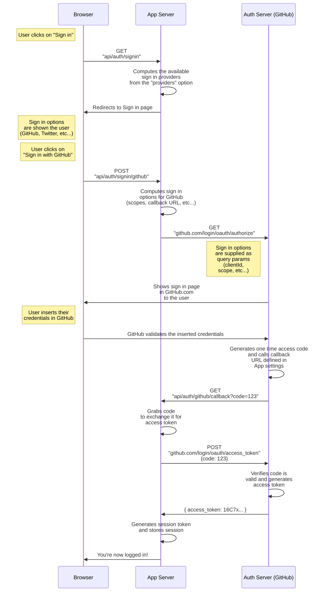

import { Callout } from "nextra/components"
import { Screenshot } from "@/components/Screenshot"

# OAuth

<Callout>
  Auth.js 设计用于与任何 OAuth 服务协同工作，支持 **OAuth 2.0** 和 **OpenID
  Connect** 协议，并为大多数主流登录服务提供内置支持。
</Callout>

**Auth.js** 中的认证提供者是预定义的 [OAuth](https://oauth.net/2/) 配置，允许用户通过其常用服务的现有账户登录。您可以使用我们预定义的任一提供者，或编写自定义的 OAuth 配置。关于自定义或编写 OAuth 提供者的详细指南，请参阅[配置 OAuth 提供者](/guides/configuring-oauth-providers)。

从高层次来看，我们支持的 OAuth **授权码**流程通常包含 6 个环节：

1. 应用程序向用户请求访问服务资源的授权
2. 若用户批准请求，应用程序将获得授权许可
3. 应用程序向授权服务器(API)提交自身身份认证及授权许可，请求访问令牌
4. 若应用程序身份验证通过且授权许可有效，授权服务器(API)会颁发访问令牌。授权流程完成。
5. 应用程序向资源服务器(API)请求资源，并出示访问令牌进行认证
6. 若访问令牌有效，资源服务器(API)将向应用程序提供所请求资源

## 流程图解

以下是两张流程图，直观展示了与上文描述的 OAuth 授权码流程相同的基本流程。第一张是时序图。

接下来是泳道图，源自 [mainmatter.com](https://mainmatter.com) 的 [Andrey Mikhaylov](https://lolma.us) 所著的优秀文章 [《使用 Auth.js 和 SvelteKit 设置 OAuth》](https://mainmatter.com/blog/2023/11/23/setting-up-oauth-with-auth-js-and-sveltekit/)。

import OAuthDiagram from "../../public/img/concepts/oauth-diagram.webp"

<Screenshot src={OAuthDiagram} alt="OAuth Flow Diagram" />

## 延伸阅读

如需了解更多，请查阅以下博客文章：

- Aaron Parecki 的博客文章 [《OAuth2 简化指南》](https://aaronparecki.com/oauth-2-simplified/)
- Postman 的博客文章 [《OAuth 2.0：隐式流程已死，请改用 PKCE》](https://blog.postman.com/pkce-oauth-how-to/)
- [《使用 Auth.js 和 SvelteKit 设置 OAuth》](https://mainmatter.com/blog/2023/11/23/setting-up-oauth-with-auth-js-and-sveltekit/) 博客文章
