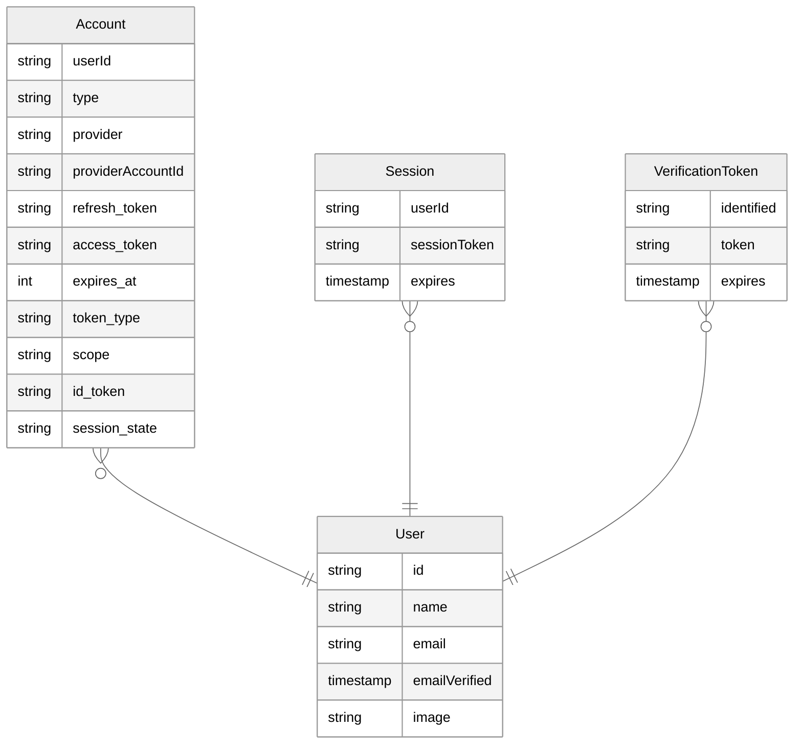

import { Callout } from "nextra/components"
import { Link } from "@/components/Link"
import manifest from "@/data/manifest.json"

# 数据库适配器

<Callout type="info">
  Auth.js 默认将会话保存在 cookie
  中。因此，配置数据库是可选的。但如果您需要在自有数据库中持久化用户信息，或实现特定流程，则必须使用数据库适配器。
</Callout>

**数据库适配器**是连接 Auth.js 与数据库的桥梁。例如[实现魔法链接](/getting-started/authentication/email)时，Email 提供商将要求您配置数据库适配器以存储链接中的[验证令牌](/concepts/database-models#verificationtoken)。

## 官方适配器

以下是官方适配器列表，它们作为独立包发布在 `@auth/` 命名空间下。源代码存放于 [`nextauthjs/next-auth` 代码库](https://github.com/nextauthjs/next-auth/tree/main/packages)。如需创建数据库适配器，请确保熟悉 Auth.js 要求的[数据模型](/concepts/database-models)，并参阅[创建数据库适配器](/guides/creating-a-database-adapter)指南。

  {Object.entries(manifest.adapters).map(([value, label]) => (
    <Link
      href={`/getting-started/adapters/${value}`}
      key={value}
      className="flex h-32 w-36 flex-col items-center justify-between rounded-lg border border-solid border-neutral-200 p-4 shadow-sm transition duration-300 hover:bg-neutral-50 dark:border-neutral-800 dark:hover:bg-neutral-950"
    >
      
      
{label}

    </Link>
  ))}

<Callout>
  如果找不到适合您所选数据库或服务的适配器，您可以
  自行创建一个。请参阅我们的指南了解[如何创建数据库
  适配器](/guides/creating-a-database-adapter)。如果您创建了新适配器，
  我们非常欢迎您[提交
  PR](/guides/creating-a-database-adapter#official-adapter-guidelines)
  与大家分享！
</Callout>

## 数据模型

这是完整数据库模式应呈现的通用 ER 图。您选择的数据库适配器将包含一个模板模式，其中包含更多细节用于将此模式应用到基础数据库。更多详情，请查看我们的[数据库模型](/concepts/database-models)文档。请注意，并非所有使用场景都需要完整的模式，更多细节请参阅我们的[数据库适配器指南](/guides/creating-a-database-adapter)。

